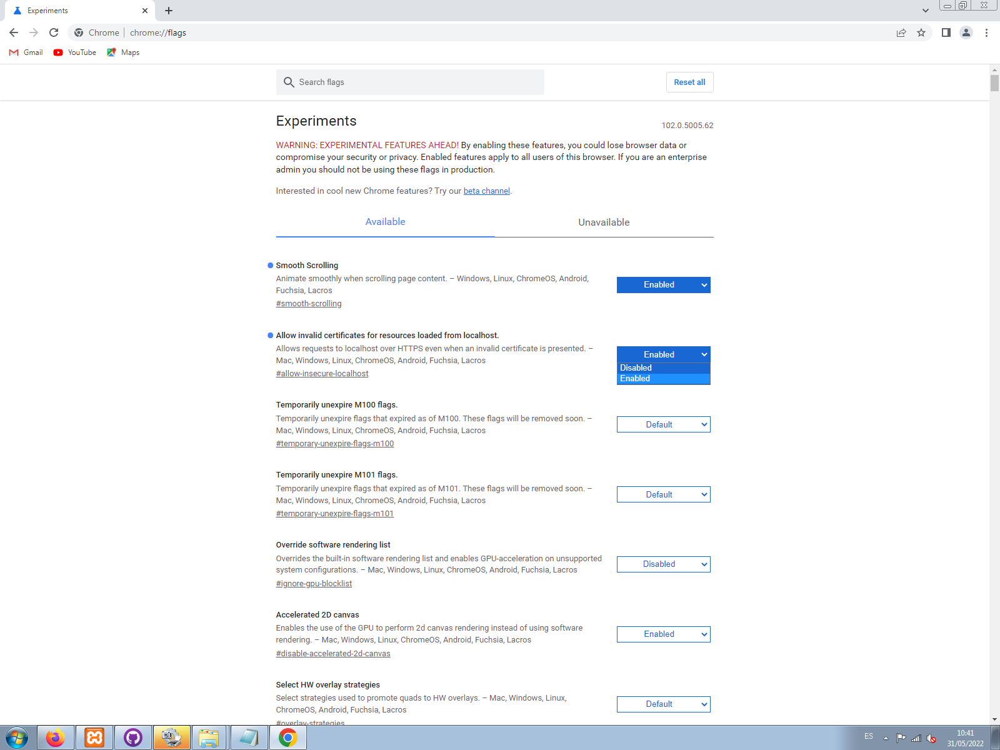

# Proyecto StarWars

## Nelson Sanchez Usero
___

Aqui se encuentra el proyecto de starwars de **Nelson Sanchez Usero**.  
AUN NO ESTA TERMINADO !!!! 

## IMPORTANTE
___

Hay un problema con angular y los navegadores con el tema de certificados, en el caso de google se resuelve así:
Para poder usarlo en chrome hay que hacer lo siguiente:

* En google chrome te vas a chrome://flags:

* El comando para insertar naves es php artisan nave:insertar

### Construido con

>Visual Studio

### Autores

>***Nelson Sanchez Usero***

___
___